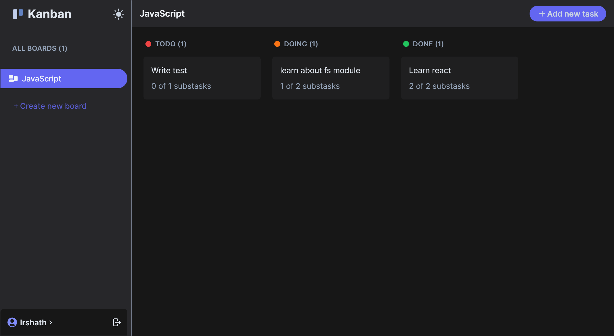

# Kanban App

A simple task manager app to keep track of your day-to-day tasks and complete them.

Link to production site: [mykanbanapp.vercel.app](https://mykanbanapp.vercel.app/)

## Screenshots

## Tech Stack

**Client:** React, React Query, TailwindCSS

[**Server:**](https://github.com/irshathcodes/kanban-api) Node, Express, MongoDB

## License

[MIT](https://choosealicense.com/licenses/mit/)

## Feedback

If you have any feedback/suggestions, please reach out to me at [@irshathcodes](https://twitter.com/irshathcodes)

